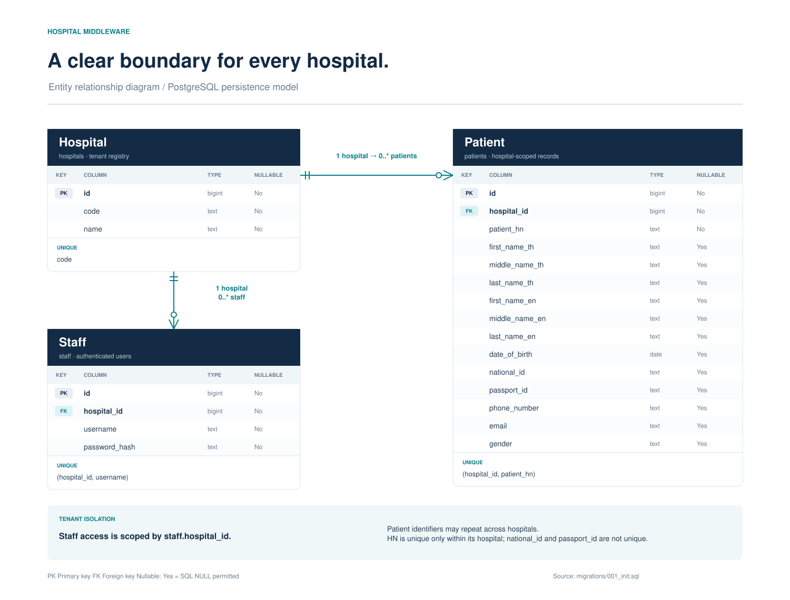

# Hospital middleware development plan

This document explains the implemented Agnos assignment for technical review. The delivery is a Go and Gin API with PostgreSQL, an HTTP hospital information system adapter, Nginx and Docker Compose. Staff authentication determines the hospital used for every patient search.

### Scope and approach

The selected Approach C calls the configured hospital system when a national ID or passport ID is supplied, validates and stores the returned patient, and applies the search filters to that patient. Searches without an identifier use locally stored records. A synthetic HTTP mock makes the complete flow reproducible without real hospital credentials.

The implementation covers staff creation, staff login and patient search with eight optional filters. The planning package includes the project structure, API contract and editable draw.io entity relationship diagram. It does not include a frontend, background synchronization or public production deployment.

### Review sequence

| Step | Review action |
| --- | --- |
| 1 | Run make setup and make up to start the local stack. |
| 2 | Run make test for Go vet, race-enabled tests and PostgreSQL integration coverage. |
| 3 | Run make smoke to exercise requests through Nginx. |
| 4 | Review docs/openapi.yaml and the editable ERD alongside the implementation. |

### Delivery boundaries

The mock demonstrates the assumed patient shape over real HTTP. It cannot establish compatibility with a real HIS. Hospital B reuses the same mock shape to test hospital isolation. Real endpoint contracts, credentials, error responses and TLS requirements must be confirmed before an operational integration.

Verification results and external GitHub and Google Docs destinations are tracked in docs/SUBMISSION.md. This plan describes the implementation and test strategy; the checklist is the source for executed validation evidence.

## Project structure and responsibilities

The code separates HTTP validation, application rules, persistence and external transport. Shared domain types allow the service to be tested without a live database or hospital system, while integration tests exercise the actual PostgreSQL repository.

| Path | Responsibility |
| --- | --- |
| cmd/api | Load configuration, connect PostgreSQL and serve the Gin API. |
| cmd/mockhis | Serve synthetic hospital A and B responses over HTTP. |
| internal/domain | Patient, staff, hospital, filters, errors and interfaces. |
| internal/httpapi | Routes, strict JSON validation and status mapping. |
| internal/service | Bcrypt, JWT authentication and search orchestration. |
| internal/postgres | Parameterized queries, scoped upserts and pagination. |
| internal/his | Timeouts, response validation and identifier checks. |
| internal/config | Validated runtime configuration. |
| migrations and seed | Schema and synthetic demonstration records. |
| nginx and compose.yaml | Reverse proxy and local service topology. |
| scripts | Bootstrap, verification, smoke and document utilities. |
| docs and output | OpenAPI, planning, ERD and importable document. |

### Design rationale

One service layer owns the search decision, keeping transport rules separate from database details. Hospital routing is configured on the server. Clients cannot provide a hospital ID or upstream URL to patient search. A repository interface supports focused unit tests without introducing a general framework.

PostgreSQL is both the staff identity store and local patient store. A unique hospital and HN pair supports atomic refresh of a fetched patient. There is no queue or cache invalidation subsystem: identifier lookups always contact the HIS, and non-identifier searches explicitly cover local data only.

## Request flow and hospital isolation

### Staff enrollment and login

An operator provisions staff through POST /staff/create using the deployment registration key. The service resolves the hospital code, hashes the password with bcrypt and inserts the staff record. A username is unique within its hospital. Login finds the staff within the supplied hospital and verifies the password before issuing a one-hour HS256 JWT.

### Authenticated search

| Stage | Behavior |
| --- | --- |
| Authenticate | Validate JWT signature, issuer, audience and expiry; re-read the staff row by subject ID. |
| Derive hospital | Use the hospital ID from the stored staff record; no client-supplied search hospital is accepted. |
| Validate filters | Require a JSON object, exact field names, valid strings and bounded pagination. |
| Choose source | National ID or passport ID uses HIS; all other requests use local PostgreSQL. |
| Fetch and verify | Call configured HIS GET /patient/search/{id}; verify returned identifier, HN, date and gender. |
| Persist and search | Upsert under the staff hospital; apply all filters with that hospital predicate. For HIS, restrict to the fetched local row ID. |
| Return | Return a paginated data array, total matching count and source label. |

### Identifier and failure semantics

When both identifiers are supplied, national ID selects the upstream request and passport ID remains an additional AND filter. A HIS 404 returns an empty result even if an older local row exists. An invalid response or network failure returns 502, an unconfigured HIS returns 503, and a timeout returns 504. There is no fallback to stale local data after a failed identifier lookup.

The adapter ignores upstream local IDs and derives hospital ownership from the authenticated context. Redirects are refused. A three-second timeout is configured in Compose and the response limit is 1 MiB. Unknown upstream fields are tolerated; nonblank HN and the queried identifier are required.

## Relational model

Each hospital has zero or more staff and patients. Each staff or patient row belongs to exactly one hospital through a non-null foreign key. The diagram is generated from the implemented migration and is editable in draw.io.



Editable source: docs/diagrams/hospital-erd.drawio. Vector preview: docs/diagrams/hospital-erd.svg. Schema authority: migrations/001_init.sql.

### Integrity and storage rules

Hospitals use a unique code. Staff use UNIQUE (hospital_id, username); patients use UNIQUE (hospital_id, patient_hn). National and passport identifiers are not globally unique, allowing the same person in multiple hospitals. HN is required and cannot be blank. All twelve demographic columns may be null. Gender, when present, is M or F.

The patient upsert refreshes all demographic fields, including null values, on a hospital and HN conflict. Indexed hospital and ID columns support stable paging; hospital and national or passport ID indexes support exact lookup. Page rows and total use one repeatable-read transaction.

## Staff API contract

All POST requests require Content-Type application/json and a single JSON object of at most 64 KiB. Unknown fields, duplicate fields, incorrectly cased keys, null required values, wrong types and trailing JSON are rejected with 400. Error responses use the common envelope described on page 7.

### Shared credentials body

| Field | Validation |
| --- | --- |
| username | Required string; trimmed; 3–64 ASCII letters, digits, dots, underscores or dashes. Case-sensitive. |
| password | Required string; 8–72 UTF-8 bytes; preserved without trimming. |
| hospital | Required string; trimmed; 1–64 ASCII letters, digits or dashes; must resolve to a configured hospital. Demo codes are A and B. |

```
{"username":"reviewer","password":"DemoPass123!",
 "hospital":"A"}
```

### POST staff create

Path: /staff/create. Header: X-Registration-Key. A correct deployment key authorizes provisioning for either configured hospital. This is independent of the staff bearer token.

```
201  {"id":1,"username":"reviewer"}
```

Expected errors: 400 for invalid input or unknown hospital; 403 for missing or incorrect registration key; 409 for an existing username within the hospital; 500 for internal or storage failure. The response omits the password hash and hospital ID.

### POST staff login

Path: /staff/login. No provisioning key or bearer token is required. The same credentials validation applies. Wrong credentials and an unknown hospital both return 401; malformed input returns 400; storage failure returns 500.

```
200  {"access_token":"<JWT>",
      "token_type":"Bearer","expires_in":3600}
```

JWT uses HS256, issuer agnos, audience agnos-api and a staff ID subject. Expiry is required. Search requires Authorization: Bearer <JWT>. Removing the staff record invalidates subsequent authenticated requests because membership is re-read.

## Patient search API contract

POST /patient/search requires a valid staff bearer token. Every filter is optional. An empty object lists stored patients within the staff hospital. Explicit null, empty or whitespace-only filters are invalid. Strings are trimmed and limited to 1–255 UTF-8 bytes; identifiers have the tighter pattern below.

| Field | Match rule |
| --- | --- |
| national_id | Exact; 1–64 ASCII letters, digits or dashes. Triggers HIS lookup. |
| passport_id | Exact; same identifier pattern. Triggers HIS when national_id is absent. |
| first_name | Case-insensitive substring of first_name_th OR first_name_en. |
| middle_name | Case-insensitive substring of middle_name_th OR middle_name_en. |
| last_name | Case-insensitive substring of last_name_th OR last_name_en. |
| date_of_birth | Exact real YYYY-MM-DD calendar date. |
| phone_number | Exact string after trimming; no numeric conversion. |
| email | Exact case-sensitive string after trimming. |
| page | Optional integer 1–1000000; default 1. |
| page_size | Optional integer 1–100; default 20. |

All supplied filters combine with AND. Name patterns treat percent, underscore and backslash as literal text. Identifiers preserve leading zeroes. Search has no hospital, hospital_id or patient_hn input field. A name or other demographic filter never starts a broad remote HIS search.

```
{"first_name":"Somchai","date_of_birth":"1990-01-15",
 "page":1,"page_size":20}
```

### Pagination and source

A successful response contains data (an array, including []), total (matching count before pagination), page, page_size and source. The source is local or his. Rows are ordered by the internal patient ID. A HIS search considers only the fetched row after filtering, so its total is zero or one. A page beyond the matches returns an empty data array while retaining the matching total.

## Response fields and error behavior

### Patient object

Every patient response contains the fields below. Demographic keys remain present with JSON null when no value is stored. Internal hospital ID is never serialized.

| Field group | JSON type and meaning |
| --- | --- |
| id | Integer int64; internal local patient row ID. |
| patient_hn | Nonblank string; patient number within a hospital. |
| first_name_th, middle_name_th, last_name_th | Each is string or null; Thai names. |
| first_name_en, middle_name_en, last_name_en | Each is string or null; English names. |
| date_of_birth | YYYY-MM-DD string or null. |
| national_id, passport_id | Each is string or null; preserves leading zeroes. |
| phone_number, email | Each is string or null. |
| gender | M, F or null. |

### Application errors

```
{"error":{"code":"validation_error",
          "message":"Null fields are not allowed"}}
```

| Status | Code and condition |
| --- | --- |
| 400 | validation_error — request validation; unknown hospital on create. |
| 401 | unauthorized — login failure or invalid staff authentication. |
| 403 | forbidden — registration key failure. |
| 409 | conflict — duplicate username within one hospital. |
| 500 | internal_error — internal or persistence failure. |
| 502 | upstream_error — unreachable, malformed or mismatched HIS. |
| 503 | his_unavailable — hospital system not configured. |
| 504 | upstream_timeout — hospital request exceeded timeout. |

The error object requires code and message and permits optional field context, currently unset. Responses avoid database details and upstream payloads. Nginx returns safe JSON errors, including 413 for oversized requests and 429 for staff rate limits. GET /healthz returns {"status":"ok"} for process liveness. GET /readyz pings PostgreSQL with a one-second deadline: 200 {"status":"ready"} or 503 {"status":"unavailable"}.

## Verification and operational handoff

### Test strategy

| Layer | Positive and negative coverage |
| --- | --- |
| HTTP API | Create, login and search success; invalid credentials; missing auth; malformed, null, duplicate or unknown JSON; invalid pagination. |
| Service | Password verification, token expiry and claims, hospital membership, source choice, upstream not-found and storage failures. |
| HIS adapter | Real HTTP mock, both hospitals, identifier mismatch, malformed/oversized payload, invalid date/gender, redirects, timeout and unavailable configuration. |
| PostgreSQL | Scoped uniqueness, all filters, literal wildcard handling, null refresh, stable pagination and overlapping cross-hospital identifiers. |
| End to end | Live Nginx entry point, staff registration and login, local and HIS searches, authentication failures and hospital isolation. |

Run make test for the containerized checks and make smoke against the running stack. scripts/check.sh executes go vet ./... and go test -race -count=1 ./.... A PostgreSQL test requires TEST_DATABASE_URL; the Compose test profile supplies it. Record actual outcomes in docs/SUBMISSION.md after completion.

### Local operation

make setup generates .env with random secrets and restrictive file permissions, preserving existing configuration. make up builds and starts the services. Only Nginx binds a host port, on 127.0.0.1. The database volume persists when make down stops the stack; initialization SQL runs only for a new volume. Local Compose database transport uses sslmode=disable on its private network.

### Remaining integration work

Before using a real HIS, verify each hospital contract and supply the confirmed base URLs, authentication and TLS settings. Local search coverage depends on seeded and previously fetched rows. Nginx limits staff creation and login to 10 requests per second per client IP with burst 20. There is no background synchronization, refresh token or production deployment. The provisioning key is a deployment-wide credential rather than a full administrator role system.

Submit the repository and import output/agnos-development-plan.docx into Google Docs after the destinations are confirmed. Keep .env, tokens and real patient data out of source control. The synthetic demo does not require real patient information.
